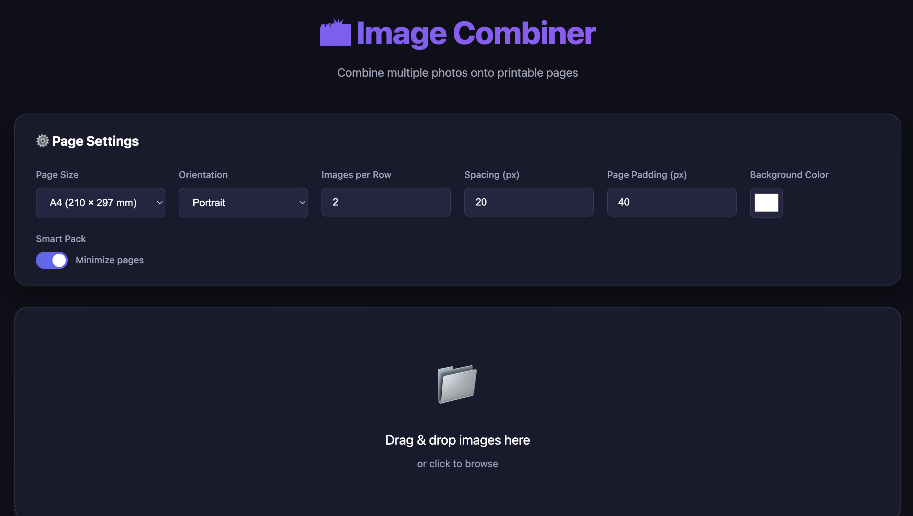

# 📸 Image Combiner

A web-based tool to combine multiple photos onto printable pages, perfect for bulk photo printing.



## ✨ Features

- **Drag & Drop Upload** - Simply drag images or click to browse
- **HEIC Support** - Automatically converts iPhone HEIC photos to JPEG
- **Smart Pack Algorithm** - Intelligently arranges photos to minimize page count
- **Configurable Page Sizes** - A4, Letter, 4×6, 5×7, or custom dimensions
- **Orientation Options** - Portrait or Landscape
- **Customizable Layout** - Adjust spacing, padding, and background color
- **Batch Download** - Download all pages as PNG images

## 🚀 Quick Start

1. Open `index.html` in your browser
2. Configure page settings (optional)
3. Drag & drop your photos
4. Click **Generate Pages**
5. Download individual pages or all at once

## ⚙️ Settings

| Setting | Description |
|---------|-------------|
| **Page Size** | A4, Letter, 4×6, 5×7, or Custom |
| **Orientation** | Portrait or Landscape |
| **Images per Row** | Grid columns (only when Smart Pack is OFF) |
| **Spacing** | Gap between images (in pixels) |
| **Page Padding** | Margin around the page (in pixels) |
| **Background Color** | Page background color |
| **Smart Pack** | Enable to automatically minimize page count |

## 🧠 Smart Pack Algorithm

When enabled, Smart Pack uses a **2D bin-packing algorithm** that:

1. **Ignores grid constraints** - Dynamically determines images per row
2. **Packs by width** - Fits as many images as possible in each row
3. **Stretches rows** - Fills the full page width (no horizontal waste)
4. **Groups by size** - Similar-sized images are placed together

This typically results in **30-50% fewer pages** compared to simple grid layouts.

## 📱 HEIC Conversion

iPhone photos in HEIC format are automatically converted to JPEG using the [heic2any](https://github.com/nickytonline/heic2any) library. Conversion happens in the browser - no upload required.

## 🛠️ Tech Stack

- **HTML5** - Structure
- **CSS3** - Modern dark theme with glassmorphism
- **Vanilla JavaScript** - No frameworks, works anywhere
- **Canvas API** - Image rendering and export
- **heic2any** - HEIC to JPEG conversion

## 📁 Project Structure

```
image-combiner/
├── index.html    # Main HTML file
├── styles.css    # Styling
├── app.js        # Application logic
└── README.md     # This file
```

## 🖨️ Printing Tips

1. **Use A4 or Letter** for standard printers
2. **Set spacing to 0** if you want images edge-to-edge
3. **White background** is recommended for printing
4. **Download as PNG** for best print quality

## 📄 License

MIT License - Feel free to use and modify!

---

Made with ❤️ for easy photo printing
